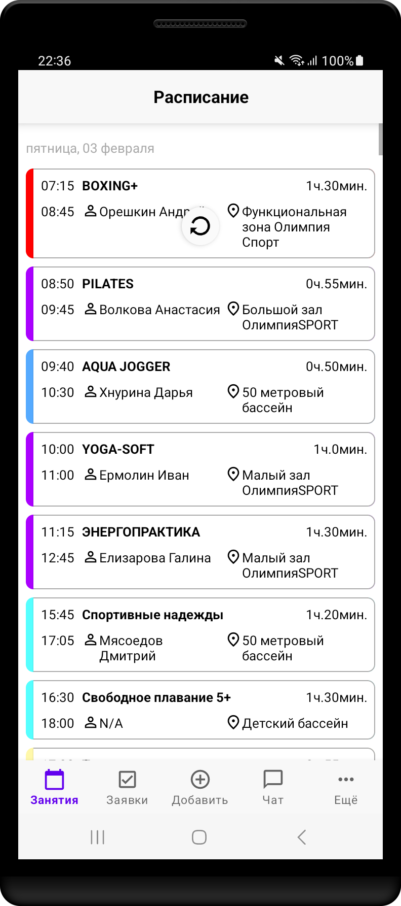

# FitnessKitTestTask

The task is to implement exercises screen of the club's exercises. Exercises must be sorted by date.
Recyclerview should display dates in format "EEEE, dd MMMM" and views for exercises classes. Create bottom bar, navigation not needed.

Exercises screen in created according to provided design.

In project are used: Retrofit, RxJava3, Hilt, Navigation, Single Activity with fragments, Swiperefreshlayout, RecyclerView.

